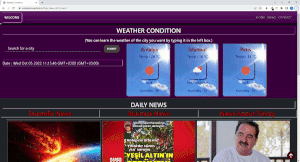

<p align="center">
<a href="https://www.linkedin.com/in/ozkankomu/" target="_blank"></a>
</p>


# Daily_News_API_Project
## Table of contents

  - [The challenge](#the-challenge)
  - [Screenshot](#screenshot)
  - [Project Skeleton ](#project-skeleton)
  - [Links](#links)
  - [Built with](#built-with)
  - [Useful resources](#useful-resources)
- [Author](#author)


## The challenge
On this site, I tried to create a news page with daily news information from the news api and the weather forecast. But since there is a publishing limit in the news api, I had to put the img in the news section when the news data did not come.


## Project Skeleton 

```
Daily_News_API_Project

----README.md                   
----images      
      photos...
----index.html  
----style.css   

```

## Screenshot
<p align="left">
<a href="https://ozkankomu.github.io/Daily_News_API_Project/"></a>
</p>


## Links
<hr>
<b>Check The Live Website ➡️</b> <a href="https://ozkankomu.github.io/Daily_News_API_Project/">Live Website</a>
<hr>

### Built with
- js DOM Manipulation
- Semantic HTML5 markup
- CSS custom properties
- Flexbox
- CSS Grid
- Mobile-first workflow
- JS DOM Manipulation	
- Api Sevices


## Notes

- I used HTML, CSS , JavaScript to complete this project.

### Useful resources

- [W3 Schoold](httpswww.w3schools.com) - This helped me for basics of website paradigm. I really liked this pattern and will use it going forward.
- [MDN](httpsdeveloper.mozilla.orgen-US) - This is an amazing document which helped me finally understand deep sides of web development. I'd recommend it to anyone still learning these concepts.


## Author

- Author - [Ozkan]

&#8987; Happy Coding  &#9997;
